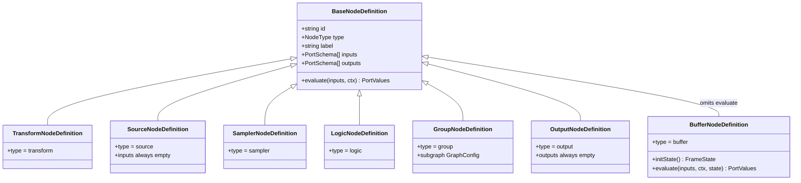
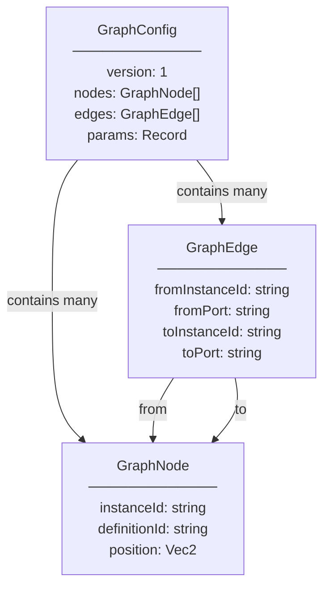
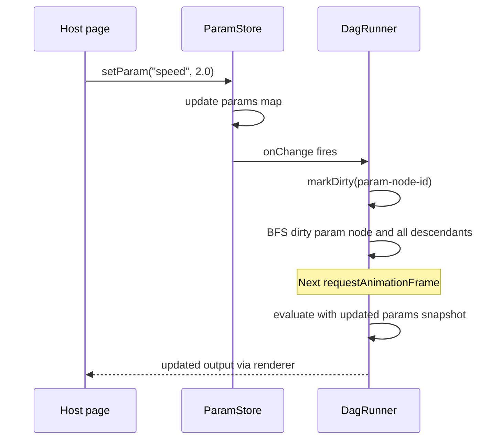
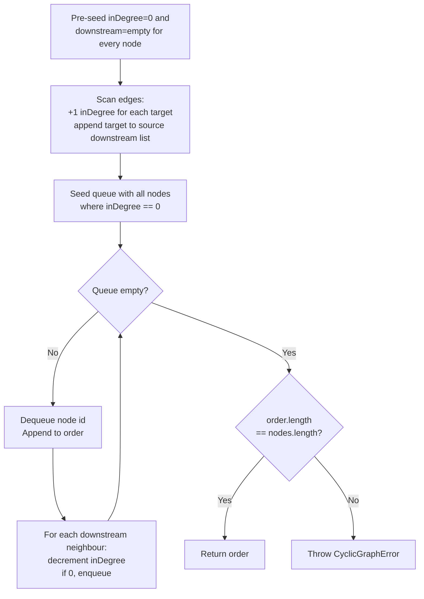
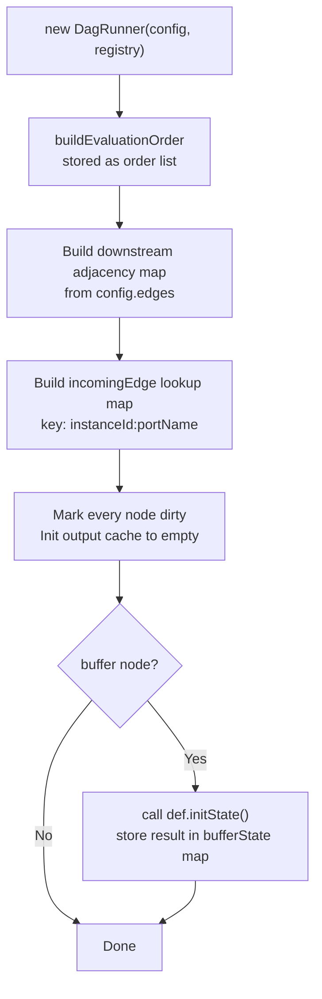
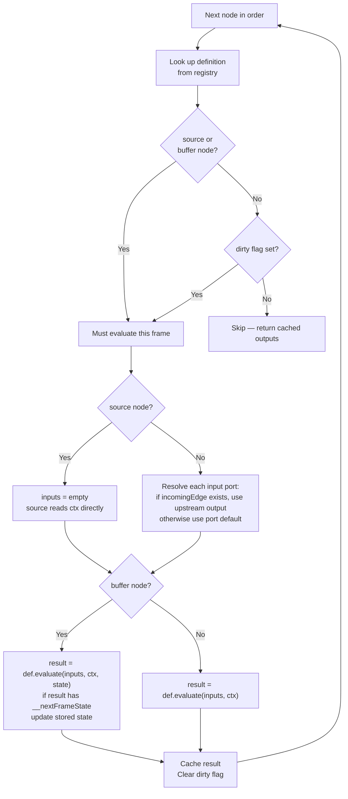
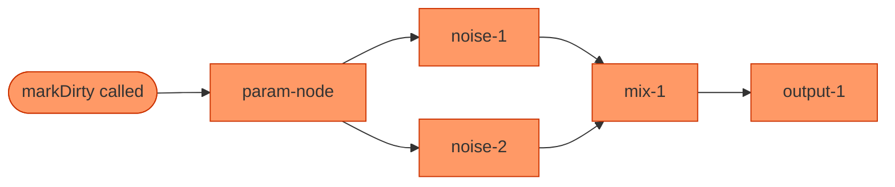
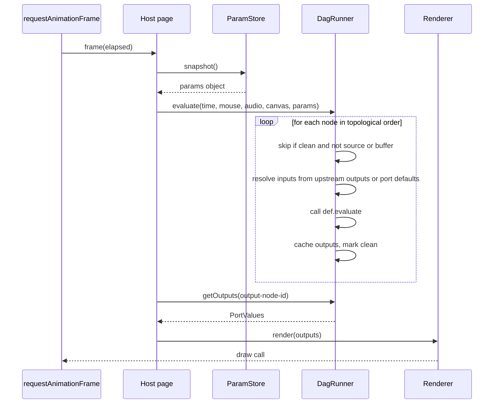
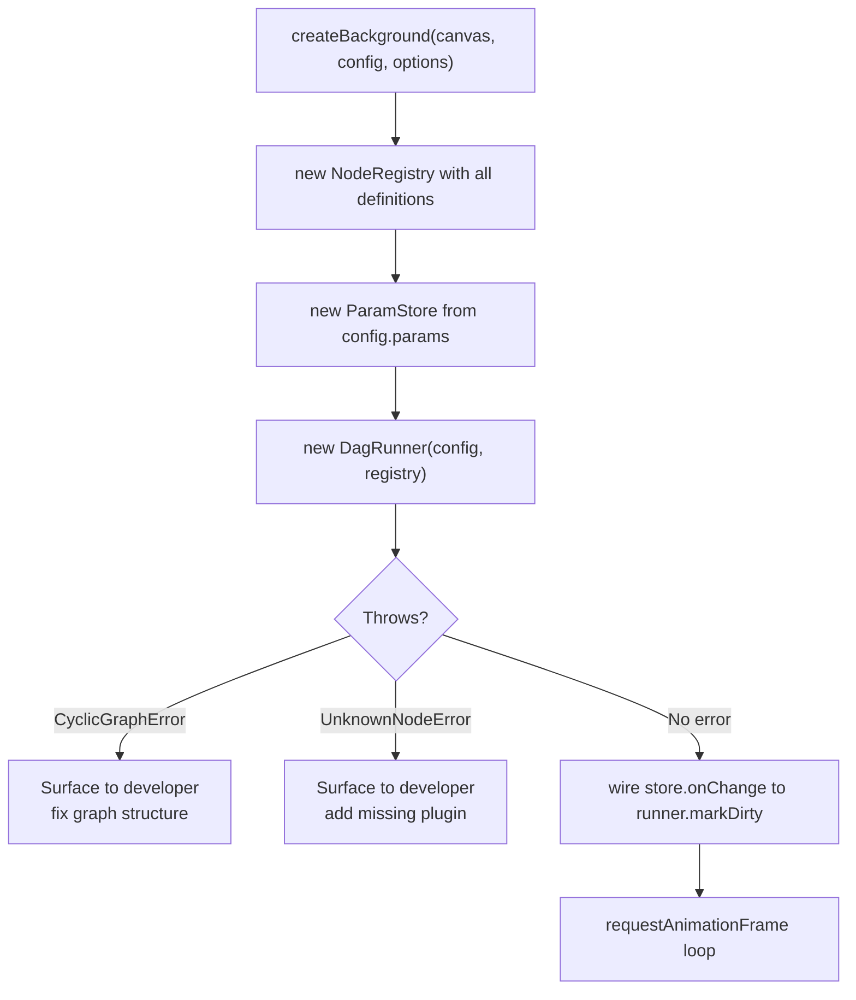

# Phase 2: `@funny-colors/core`

**Status:** Complete  
**Tests:** 53 passing — 100 % line / function / branch / statement coverage  
**ADRs:** [ADR-002](../../adr/ADR-002-execution-model.md) · [ADR-006](../../adr/ADR-006-node-extensibility.md) · [ADR-009](../../adr/ADR-009-runtime-params.md) · [ADR-015](../../adr/ADR-015-error-handling-standard.md)

---

## Overview

`@funny-colors/core` is the pure-TypeScript engine that sits at the centre of every other package. It has no rendering, no DOM, no GPU. It answers one question: **given a graph of nodes and a frame context, what values come out?**

| Concern | Export | File |
|---|---|---|
| Type contracts | All interfaces | `src/types/types.ts` |
| Node registry | `NodeRegistry` | `src/registry/registry.ts` |
| Runtime params | `ParamStore` | `src/param-store/param-store.ts` |
| DAG engine | `buildEvaluationOrder`, `DagRunner` | `src/dag/dag.ts` |
| Errors | `CyclicGraphError`, `UnknownNodeError` | `src/errors/errors.ts` |

---

## Module Structure

```
packages/core/src/
├── types/
│   ├── types.ts          ← all public interfaces (zero executable code)
│   └── index.ts          ← re-export barrel
├── errors/
│   ├── errors.ts
│   ├── errors.test.ts
│   └── index.ts
├── registry/
│   ├── registry.ts
│   ├── registry.test.ts
│   └── index.ts
├── param-store/
│   ├── param-store.ts
│   ├── param-store.test.ts
│   └── index.ts
├── dag/
│   ├── dag.ts
│   ├── dag.test.ts
│   └── index.ts
└── index.ts              ← root barrel: re-exports all of the above
```

All cross-module imports use bare folder paths (e.g. `from '../registry'`). The `moduleResolution: "bundler"` setting in every `tsconfig.json` resolves these through each folder's `index.ts` barrel.

---

## Glossary

| Term | Meaning |
|---|---|
| **Definition** | A static, reusable node type (`NodeDefinition`). Contains a port schema and an `evaluate` function. |
| **Instance** | A placed copy of a definition in the user's graph (`GraphNode`). Has an `instanceId`. |
| **Port** | A typed input or output slot on a node. Carries a `PortValueType` and an optional default. |
| **Edge** | A directed connection from one node's output port to another node's input port (`GraphEdge`). |
| **Graph config** | The serialised user graph (`GraphConfig`). Produced by the builder; consumed by the runtime. |
| **Evaluation order** | A topologically sorted list of `instanceId` strings, upstream → downstream. |
| **Dirty flag** | A per-instance boolean. `true` = must re-evaluate this frame; `false` = may skip. |
| **Frame state** | Opaque per-instance data owned by Buffer nodes. Persists across frames. |
| **ExecutionContext** | Per-frame data injected into every Source node: time, mouse, audio, canvas size, params. |

---

## 1. Type System (`src/types/types.ts`)

This file contains only TypeScript interface/type declarations — no executable code. It is excluded from coverage.

### 1.1 Port types

```ts
type PortValueType = 'float' | 'vec2' | 'vec3' | 'vec4' | 'color' | 'boolean' | 'int'

interface PortSchema {
  name: string
  type: PortValueType
  default?: unknown   // used when no upstream edge connects to this port
}

type PortValues = Record<string, unknown>  // port name → runtime value
```

### 1.2 ExecutionContext

Injected into every Source node on each frame:

```ts
interface ExecutionContext {
  time: number                              // elapsed seconds since start
  mouse: [number, number]                   // normalised [0,1] position on canvas
  audio: Float32Array | null                // frequency data, null if no audio source
  canvas: { width: number; height: number }
  params: Record<string, unknown>           // snapshot of ParamStore at frame time
}
```

### 1.3 Node taxonomy

Seven node types are enforced as a TypeScript discriminated union. All share a `BaseNodeDefinition` interface:



**Key type constraints:**

- `SourceNodeDefinition.inputs: []` — empty tuple enforced at the TypeScript level. Source nodes never receive upstream values; all data comes from `ctx`.
- `OutputNodeDefinition.outputs: []` — terminal node, no downstream ports.
- `BufferNodeDefinition` uses `Omit<BaseNodeDefinition, 'evaluate'>` instead of a plain `extends`. This allows the `evaluate` override to accept a third `state: FrameState` argument without conflicting with the 2-argument base signature.

### 1.4 Graph config



`GraphConfig` is the serialised contract between the builder and the runtime. The builder produces it; `createBackground` consumes it.

### 1.5 Runtime API

```ts
interface BackgroundInstance {
  setParam(name: string, value: unknown): void
  destroy(): void
}
```

---

## 2. Errors (`src/errors/errors.ts`)

Both errors follow [ADR-015](../../adr/ADR-015-error-handling-standard.md): a named `Error` subclass with a stable `code` field and `name` set explicitly in the constructor to survive minification.

### `CyclicGraphError`

```ts
class CyclicGraphError extends Error {
  readonly code = 'CYCLIC_GRAPH' as const
}
```

Thrown by `buildEvaluationOrder` when Kahn's algorithm exhausts the queue before processing all nodes — meaning at least one node is trapped in a cycle. Always a **startup error** (thrown before any frame runs).

### `UnknownNodeError`

```ts
class UnknownNodeError extends Error {
  readonly code = 'UNKNOWN_NODE' as const
  readonly definitionId: string
}
```

Thrown by `NodeRegistry.get()` — and transitively by `DagRunner` construction — when a `GraphNode.definitionId` is not in the registry. Always a **startup error**. The `definitionId` field names exactly which node type is missing.

---

## 3. NodeRegistry (`src/registry/registry.ts`)

A thin wrapper around `Map<string, NodeDefinition>`. Built once at startup; read-only during frame evaluation.

```ts
class NodeRegistry {
  constructor(definitions: NodeDefinition[])
  get(id: string): NodeDefinition           // throws UnknownNodeError if missing
  has(id: string): boolean
  register(definition: NodeDefinition): void  // last registration wins for same id
}
```

Construction maps every definition by its `id`. `register()` is available for adding plugins after initial construction — it overwrites any existing entry for the same id.

```ts
const registry = new NodeRegistry([...builtins, ...plugins])
```

---

## 4. ParamStore (`src/param-store/param-store.ts`)

Holds the named runtime parameters declared in `GraphConfig.params`. The host page writes via `BackgroundInstance.setParam()`; the DAG runner reads a snapshot into `ExecutionContext.params` each frame.

```ts
class ParamStore {
  constructor(initial: Record<string, unknown>)
  get(name: string): unknown
  set(name: string, value: unknown): void       // fires all listeners synchronously
  onChange(cb: (name: string, value: unknown) => void): () => void  // returns unsubscribe
  snapshot(): Record<string, unknown>           // shallow copy, safe to pass as ctx.params
}
```

**Behaviour:**
- `set()` always fires listeners on every call — even if the value is unchanged. Deduplication is the caller's responsibility.
- `set()` with an undeclared key is allowed: the value is stored and listeners fire. The DAG runner ignores params that have no corresponding `ParamNode` in the graph.
- `snapshot()` returns a new plain object each call — mutating it does not affect the store.
- `onChange` returns an unsubscribe function; calling it removes only that listener without affecting others.

**Integration with DagRunner:**



---

## 5. buildEvaluationOrder (`src/dag/dag.ts`)

```ts
function buildEvaluationOrder(config: GraphConfig): string[]
```

Converts a flat graph config into a topologically ordered list of `instanceId` strings (upstream → downstream). Called once at startup before constructing a `DagRunner`. Must be called again if graph structure changes.

**Algorithm (Kahn's BFS topological sort):**



**Pre-seeding detail:** Both maps are populated for every node in `config.nodes` *before* the edge scan. This guarantees the `!` non-null assertions in the edge loop are always safe — no node can be referenced by an edge that wasn't declared first.

---

## 6. DagRunner (`src/dag/dag.ts`)

```ts
class DagRunner {
  constructor(config: GraphConfig, registry: NodeRegistry)
  evaluate(ctx: ExecutionContext): void
  getOutputs(instanceId: string): PortValues
  markDirty(instanceId: string): void
}
```

### 6.1 Construction



Five things happen at construction:

1. `buildEvaluationOrder(config)` → stored as the private `order` list. May throw `CyclicGraphError`.
2. `downstream` adjacency map built from `config.edges` — used by `markDirty`.
3. `incomingEdge` lookup map built from `config.edges` — keyed `"instanceId:portName"` for O(1) input resolution during evaluation.
4. Every node starts dirty; output cache initialised to an empty map.
5. For every Buffer node: `def.initState()` called exactly once; result stored in `bufferState` map.

### 6.2 evaluate(ctx)

Iterates the ordered node list (guaranteed upstream → downstream) and processes each node:



**Why Source nodes always re-evaluate:** Their data comes from `ctx` (time, mouse, audio) which changes every frame. There is no upstream connection whose dirty flag could capture this change.

**Why Buffer nodes always re-evaluate:** Their frame state changes every time they run. A Buffer node accumulates state — skipping it when "clean" would silently freeze its output.

**`__nextFrameState` contract:** If a Buffer node's return value contains the key `__nextFrameState`, its value replaces the stored `FrameState` for the next frame. If the key is absent, the stored state is left unchanged. This key is an internal convention between `dag.ts` and buffer node authors — it does not appear in any public type.

### 6.3 getOutputs(instanceId)

Returns the cached output map for the given node, or an empty map if the id is unknown or the node has never been evaluated.

### 6.4 markDirty(instanceId)

BFS over the downstream adjacency map starting from `instanceId`. Marks every reachable node dirty. Already-dirty nodes are not re-queued (idempotent). An unknown `instanceId` is a no-op.

The diagram below shows a param change dirtying an entire subgraph. Nodes shown in the affected path are re-evaluated on the next frame; any disconnected clean nodes are skipped.



---

## 7. Frame Lifecycle



---

## 8. Startup Sequence



All errors thrown during startup must be caught and surfaced to the developer before the animation loop begins. No runtime errors are expected from a valid, fully-registered graph.

---

## 9. Vitest Configuration

```ts
// packages/core/vitest.config.ts
export default defineConfig({
  test: {
    environment: 'node',
    coverage: {
      provider: 'v8',
      thresholds: { lines: 95, functions: 95, branches: 95, statements: 95 },
      include: ['src/**/*.ts'],
      exclude: [
        'src/**/*.test.ts',   // test files
        'src/**/index.ts',    // barrel re-exports — no logic to test
        'src/types/types.ts', // pure TypeScript declarations, no executable code
      ],
    },
  },
})
```

---

## 10. Test Coverage

| File | Tests | Notes |
|---|---|---|
| `errors/errors.ts` | 9 | `name`, `code`, `instanceof Error`, `definitionId`, message content |
| `registry/registry.ts` | 9 | get/has/register, last-wins, UnknownNodeError fields |
| `param-store/param-store.ts` | 13 | get/set, onChange fires, unsubscribe, snapshot isolation |
| `dag/dag.ts` | 22 | topological sort, cycle detection, dirty flagging, buffer state, diamond graph, fan-in |
| **Total** | **53** | **100 % line/function/branch/statement** |

Key DAG test scenarios:

- Single-node graph, linear chain, disconnected nodes — order correctness
- `CyclicGraphError` on a directed cycle; `.code` field is stable
- Source nodes re-evaluate on every frame regardless of dirty flag
- Clean transform node skipped; `markDirty` revives it on next frame
- `markDirty` propagates to all transitive descendants; siblings untouched
- Buffer: `initState` called once; `__nextFrameState` accumulates across 3 frames; absent `__nextFrameState` leaves state frozen
- Diamond graph (two paths converging on one sink): both paths resolve before sink
- Two-source fan-in: both sources correctly feed one transform
- `getOutputs` on unevaluated or unknown node returns empty map
- `markDirty` on unknown `instanceId` is a no-op, no throw

---

## 11. Definition of Done

- [x] `pnpm --filter @funny-colors/core build` — generates `dist/index.js`, `dist/index.cjs`, `dist/index.d.ts`
- [x] `pnpm --filter @funny-colors/core test` — 53 tests, 100 % coverage across all dimensions
- [x] No TypeScript errors (`pnpm --filter @funny-colors/core typecheck`)
- [x] All public symbols exported from `src/index.ts`: `CyclicGraphError`, `UnknownNodeError`, `NodeRegistry`, `ParamStore`, `buildEvaluationOrder`, `DagRunner`, plus all interfaces from `src/types/`
- [x] ADR-015 written for error handling standard
- [x] Per-folder module structure with named implementation files (not bare `index.ts`)
